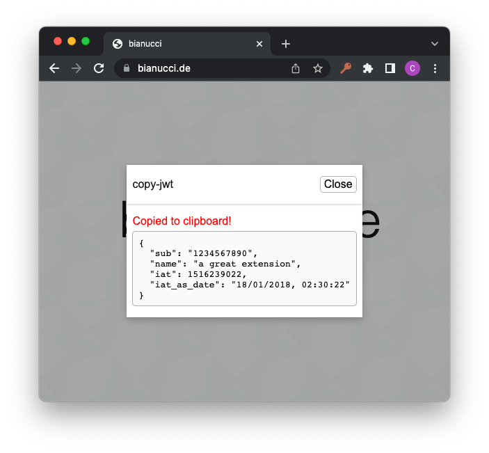
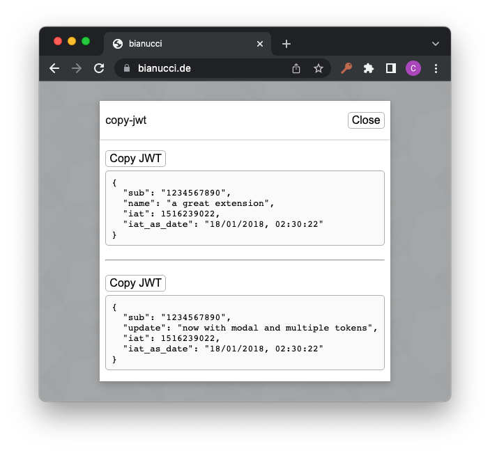
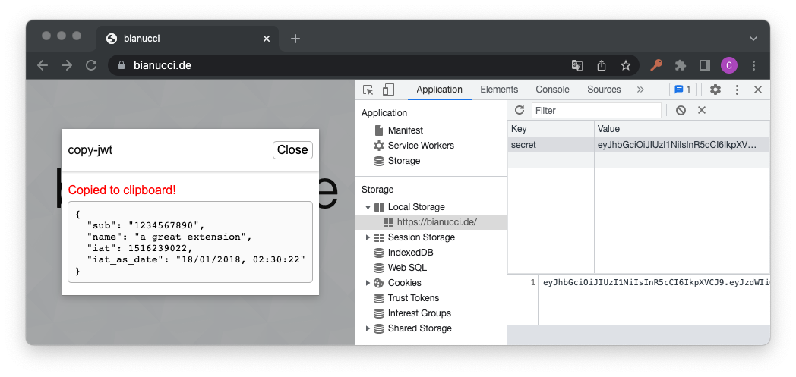

# copy-jwt

## Install

Via [Google Chrome Web Store](https://chrome.google.com/webstore/detail/copy-jwt/mnmgmnigoeabimncikdolaekjmfeeghi)

## Usage

Visit a website which contains JWT tokens in local storage and click the extension button (key icon).

If a single token was found it is copied directly into the clipboard.

If multiple tokens were found you can select which one you would like to copy.

### MSAL v5 support

Pages using [MSAL.js](https://github.com/AzureAD/microsoft-authentication-library-for-js) v3+ automatically encrypt tokens in localStorage. The extension detects and decrypts these tokens transparently using the session encryption key that MSAL stores in the `msal.cache.encryption` cookie.

Both **idToken** (user identity) and **accessToken** (API authorization) are extracted and labeled in the selection modal. Decryption requires the browser session to still be active — MSAL removes the encryption key cookie when the browser closes.

## Develop

Instructions

1. Build

    ```bash
    npm run dist
    ```

2. Manually install extension to Google Chrome, using `dist` directory.

3. Open `test.html` in Google Chrome and run extension

4. Modify code and `npm run build` to see changes

## Screen Shots

**single token:**


**multiple token:**


**local storage:**

